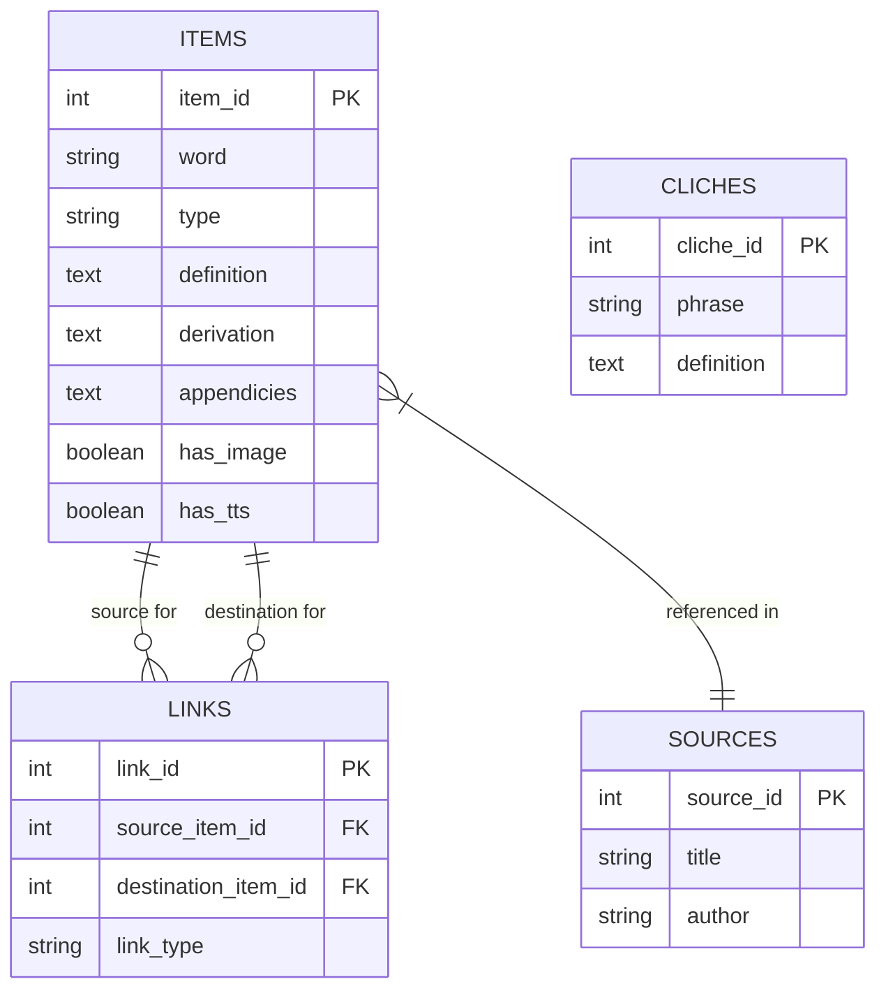

# Data Modeling

The Poetry Application uses a hybrid data model consisting of a relational SQLite database for persistence and structured Go/TypeScript types for runtime application logic.

## 1. Entity-Relationship Diagram (ERD)

The core of the system is the `items` table, which acts as the central node in a graph. Items are connected to each other via the `links` table.



## 2. Core Schema

### Items Table (`items`)
The `items` table is the primary storage unit. It represents a word, phrase, or concept.

| Column | Type | Description |
|--------|------|-------------|
| `item_id` | INTEGER | Primary Key |
| `word` | TEXT | The main term being defined |
| `type` | TEXT | Category (e.g., 'Reference', 'Poem') |
| `definition` | TEXT | Raw text content, potentially containing markup tags |
| `derivation` | TEXT | Etymology or origin info |
| `appendicies` | TEXT | Additional context or notes |
| `source` | TEXT | Citation string |
| `has_image` | INTEGER | Boolean flag (0/1) indicating image availability |
| `has_tts` | INTEGER | Boolean flag (0/1) indicating TTS audio availability |

### Links Table (`links`)
The `links` table implements a directed graph structure between items.

| Column | Type | Description |
|--------|------|-------------|
| `link_id` | INTEGER | Primary Key |
| `source_item_id` | INTEGER | FK to `items.item_id` (The origin) |
| `destination_item_id` | INTEGER | FK to `items.item_id` (The target) |
| `link_type` | TEXT | Relationship type (default: 'related') |

## 3. Rich Text Data Structure

While the database stores definitions as raw text, the application parses this text into a structured format for rendering. This is handled by the `pkg/parser` Go package and mirrored in the frontend.

### The Parsing Process
Raw text is parsed into a list of `Segments`.

1. **Raw Text**: `The definition of {word: poetry} is...`
2. **Parsed Structure** (`ParsedDefinition`):
   ```json
   [
     {
       "type": "text",
       "tokens": [
         { "type": "text", "content": "The definition of " },
         { "type": "reference", "refType": "word", "refWord": "poetry", "content": "poetry" },
         { "type": "text", "content": " is..." }
       ]
     }
   ]
   ```

### Segment Types
- **`text`**: Standard prose content.
- **`quote`**: Blockquotes or citations.
- **`poem`**: Special formatting for poetic verses.

### Token Types
Within a text segment, content is tokenized:
- **`text`**: Plain text.
- **`reference`**: A clickable link to another item, generated from tags like `{word: value}`, `{writer: value}`, or `{title: value}`.

## 4. Auxiliary Domains

### Cliches
Stored in the `cliches` table. Represents common phrases or idioms.
- **Fields**: `phrase`, `definition`.

### Names
Stored in the `names` table. Represents proper nouns, characters, or literary figures.
- **Fields**: `name`, `type`, `gender`, `description`.

### Literary Terms
Stored in the `literary_terms` table. Represents technical terms used in literature.
- **Fields**: `term`, `type`, `definition`, `examples`.

## 5. Search Architecture

The application uses SQLite's **FTS5 (Full-Text Search)** extension for high-performance text searching.

- **`items_fts`**: Virtual table indexing `word`, `definition`, `derivation`, and `appendicies` from the `items` table.
- **`cliches_fts`**: Virtual table indexing `phrase` and `definition` from the `cliches` table.
- **`literary_terms_fts`**: Virtual table indexing `term` and `definition` from the `literary_terms` table.

Queries against these tables allow for fast keyword matching and ranking, which are then joined back to the main tables to retrieve full records.
